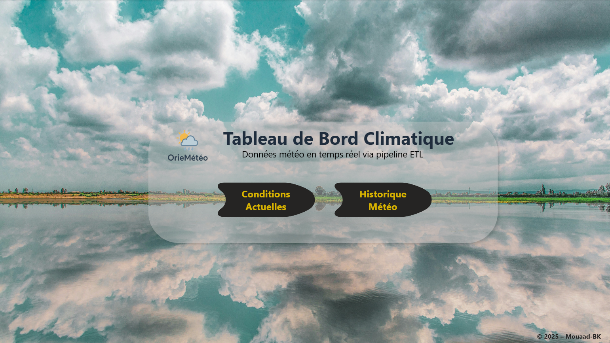
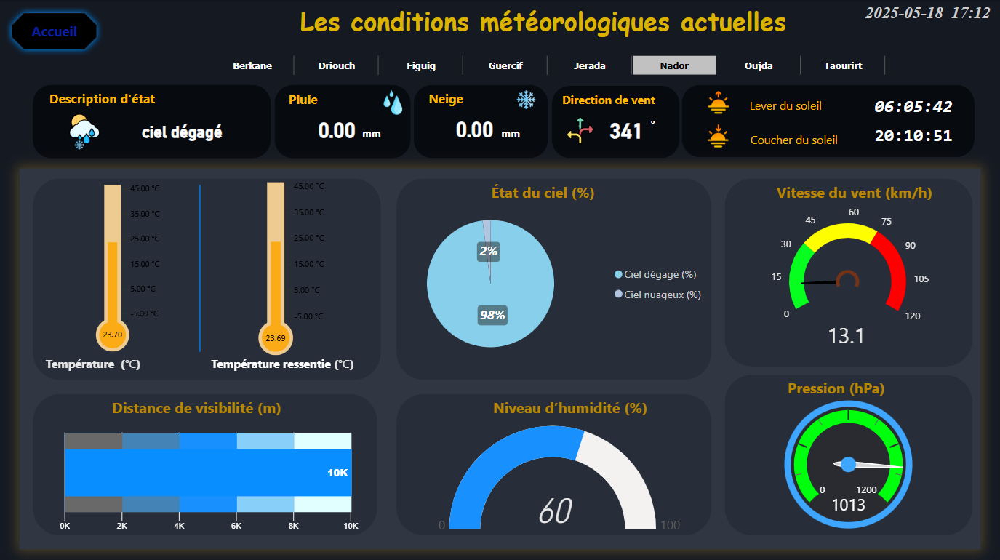
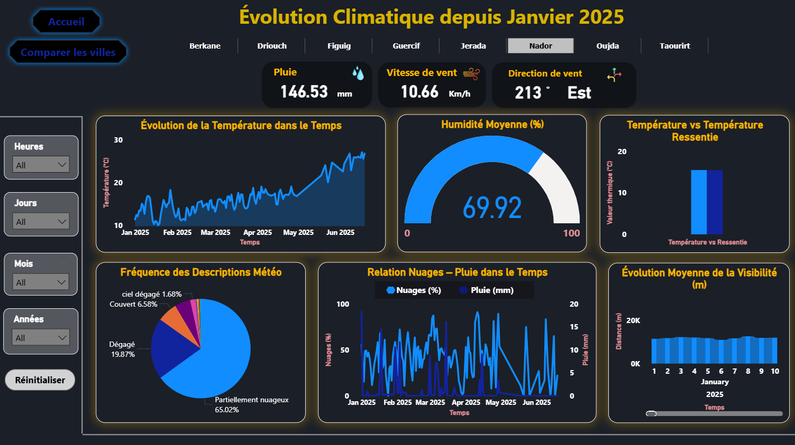

# Weather ETL Pipeline

An end-to-end ETL pipeline for collecting, transforming, storing, and analyzing hourly weather data, designed as a data engineering project focused on scalable climate data processing.

## Overview

This project implements an automated ETL pipeline for collecting and processing hourly weather data from eight cities in Eastern Morocco: Oujda, Nador, Berkane, Driouch, Taourirt, Jerada, Guercif, and Figuig.

Weather data is extracted from the OpenWeather API and enriched with static CSV files for older periods. The data is cleaned and transformed using Python scripts before being stored in a PostgreSQL database hosted on the Railway cloud platform.

Apache Airflow orchestrates the workflow in a Docker environment, ensuring continuous hourly execution. The processed data is then used in Power BI to provide an interactive dashboard for climate analysis and decision support.

The project demonstrates a scalable data engineering architecture designed for reliable weather data collection, historical storage, and analytical visualization.

---

## Architecture


## Features / Capabilities

- Automated hourly extraction of weather data from the OpenWeather API
- Integration of historical weather records from static CSV archives
- Data cleaning, normalization, and preprocessing using Python
- Validation checks to ensure consistency and reliability of records
- Structured storage of hourly and cumulative historical datasets
- Cloud-hosted PostgreSQL database for scalable data management
- Automated workflow scheduling with Apache Airflow
- Interactive Power BI dashboard for weather data visualization and analysis
- Historical trend exploration and city-to-city comparison


## Tech Stack

- Python
- PostgreSQL
- Railway (Cloud Hosting)
- Apache Airflow
- Docker
- Power BI
- OpenWeather API

## Project Structure

```
WEATHER_ETL_PIPELINE/
│
├── airflow/
│   ├── dags/          # Airflow DAG definitions
│   ├── logs/          # Airflow execution logs
│   ├── plugins/       # Custom Airflow plugins
│   └── scripts/
│       ├── extract/   # Data extraction scripts
│       ├── transform/ # Data cleaning & transformation scripts
│       └── load/      # Database loading scripts
│
├── docker-compose.yaml # Docker services configuration
├── dashboard/          # Power BI dashboard files
├── data_csv/           # Static CSV historical datasets
├── .env                # Environment variables (API keys, DB config)
├── requirements.txt    # Python dependencies
├── commandes.txt       # Utility commands / setup notes
└── README.md
```

## Database Schema

The final PostgreSQL database stores two analytical tables used for visualization and long-term storage.

### 1. weather_data

This table contains the cumulative historical dataset built from CSV archives and API ingestion.

Columns:

- Ville — city name
- Date — observation date
- Heure — observation hour
- Température (°C) — measured temperature
- Ressentie (°C) — perceived temperature
- Température max (°C) — maximum recorded temperature
- Température min (°C) — minimum recorded temperature
- Humidité (%) — humidity level
- Pression (hPa) — atmospheric pressure
- Nuages (%) — cloud coverage
- Visibilité (m) — visibility distance
- Vent (km/h) — wind speed
- Direction du vent (°) — wind direction in degrees

This table represents the long-term historical weather archive.

---

### 2. this_hour_weather_data

This table stores the latest hourly weather snapshot extracted directly from the API.

Columns:

- Ville — city name
- Date — observation date
- Heure — observation hour
- Température (°C)
- Ressentie (°C)
- Température max (°C)
- Température min (°C)
- Humidité (%)
- Pression (hPa)
- Nuages (%)
- Visibilité (m)
- Vent (km/h)
- Direction du vent (°)
- Lever du soleil — sunrise time
- Coucher du soleil — sunset time

This table is refreshed hourly and feeds real-time dashboard visualizations.


## How to Run

### Requirements

- OpenWeather API key
- Railway account with a PostgreSQL database
- Docker and Docker Compose
- Apache Airflow (runs inside Docker)
- Windows environment (tested)

---

### Setup

1. Clone the repository:

```
git clone <your-repo-url>
cd WEATHER_ETL_PIPELINE
```

2. Create a `.env` file and configure:

```
OPENWEATHER_API_KEY=your_api_key
DB_HOST=your_railway_host
DB_USER=your_username
DB_PASSWORD=your_password
DB_NAME=your_database
```

3. Start Docker services:

```
docker-compose up
```

4. Open Airflow in your browser and enable the DAG.

The pipeline will then run automatically and update the database hourly.

## Dashboard

The Power BI dashboard is organized as a structured navigation interface designed for both real-time monitoring and historical analysis.

### Home Page

The landing page acts as a navigation hub with two main buttons:

- **Current Conditions**
- **Historical Weather**



---

### Current Conditions Dashboard

This page displays real-time weather metrics for all eight cities using the `this_hour_weather_data` table.

It includes:

- KPI indicators for key measurements
- Temperature, humidity, pressure, and wind charts
- City-specific visual summaries

Each city is represented through dynamic visual components updated hourly.



---

### Historical Weather Dashboard

This section is split into two analytical pages.

#### Historical Trends

A date filter allows exploration of past weather records using the cumulative historical dataset.

It provides:

- Time-series analysis
- Temperature evolution
- Climate pattern tracking



---

#### City Comparison

This page focuses on multi-city comparison without filtering by individual city.

It highlights:

- Cross-city performance charts
- Comparative weather patterns
- Aggregated visual analytics


## Conclusion

This project demonstrates the design and implementation of a complete ETL pipeline for weather data engineering, combining automated extraction, transformation, storage, and visualization in a scalable architecture.

It highlights the practical integration of modern data engineering tools to support reliable climate data analysis and decision-making.
